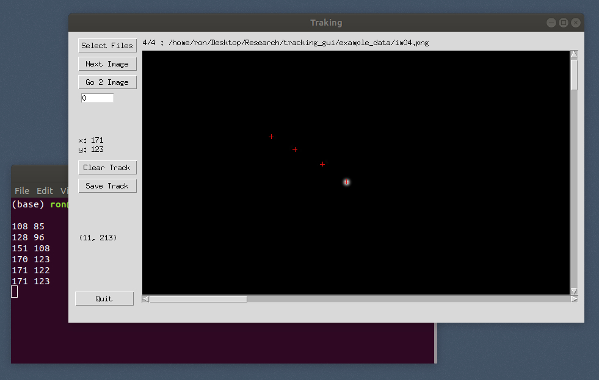

# PyTrackingGUI: a manual object tracking GUI

This is a simple python based GUI used for manually tracking objects through series of images. To use it, you'll need to have Python3 working on your PC along with the Tkinter package (using the anaconda distribution is highly recommended).

first initiated: Dec. 2015
last updated: Apr. 2021
by Ron Shnapp

## Usage instructions:

Run gui1.py through python; do this by opening your Terminal/Command Prompt at the directory of the repository and then enter:

`$ python gui1.py `

To start tracking:

1) choose a series of images with an object to track through "Select Files"  
2) use the buttons/arrow keys to navigate through your images, and +/- keys to zoom in or out
3) for each image, click the object you are tracking
4) save the results (object's coordinates) as tab separated values by clicking "Save Track"

Warning - don't drink and track!

